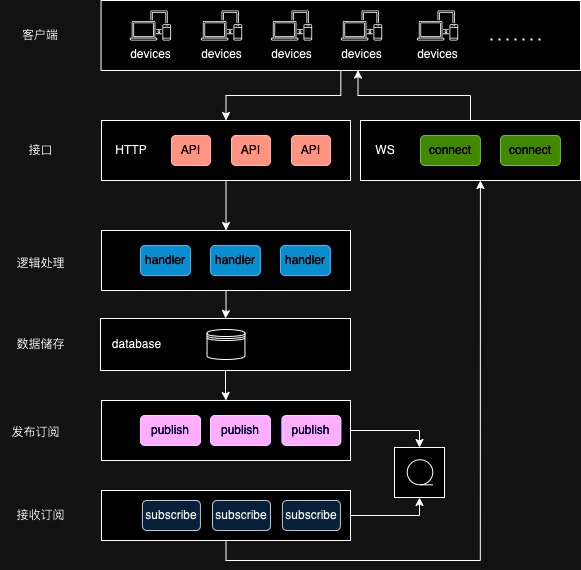
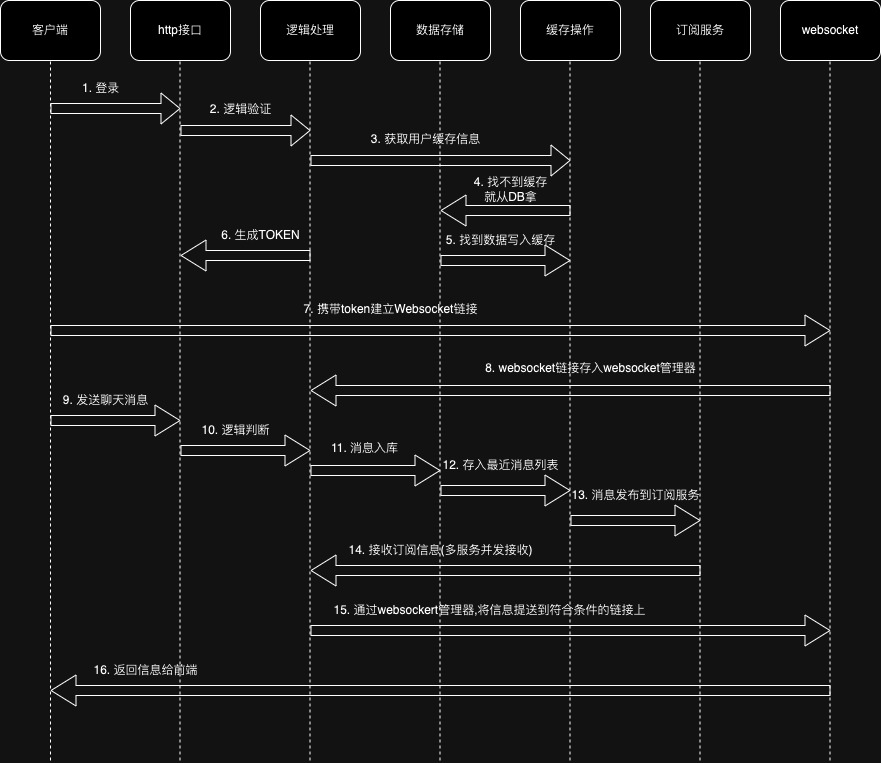

# JIM 一个简单的聊天系统
*(本代码仅供学习,严禁用于非法行为)*

## 简介
JIM 是一个轻量的聊天系统，

* 代码纯golang编写,支持私聊、群聊和世界频道聊天
* 实现了一些常用的功能。包括邀请成为好友、搜索好友、加好友、删好友、创建群、加入群、邀请进群、退出群等常规接口。
* 业务易扩展，代码相对整洁，有做了详细备注
* 日志系统相对完善，详细记录了业务各项字段，日志输出为json格式，方便ELK收集使用。
* 使用交叉编译可以进行跨平台编译及部署
* 使用swag文档规范,使用swag init 即可生成对应API文档,方便前端进行调试
* ~~漂亮的前端界面~~
* 使用了神奇的github action,多平台编译,可在release下载对应平台执行文件

## 相关组件
    语言:  golang  
    依赖服务:  redis、mongodb、mysql/mariadb
    日志包： github.com/rs/zerolog
    sql操作: github.com/jmoiron/sqlx

## 设计
    1）MySQL作为用户信息、好友关系、群组信息的存储数据库；MongoDB用于消息存储数据库。 Redis作为订阅服务、缓存存储服务。
    2）用户登录获取token,并使用token进行建立ws链接,由于发送消息需要权限验证及一些策略过滤,需要响应是否发送完成,所以ws链接一般只用于接收服务端消息,发送聊天消息不依赖ws。
    3）在多服务实例的情况下,由于用户建立WS链接的服务器是随机的,所以我们在每个服务实例里使用`websocket.manager`包的管理器进行链接统一管理,订阅到的数据最终也有管理器进行分发到不同的用户链接上。
    4）因为我们需要管理聊天消息，所以发消息时，消息是先入库，成功后再进行订阅推送。
    5）支持获取每个房间的最近X条消息，及历史消息遍历。
## 设计图纸

##### 消息发送基本架构图

##### 消息发送时序图

## 初始化
    1. 部署好相关服务：mysql/mariadb、mongodb、redis
    2. 配置config文件：config.yml从文件夹 config 里面获取,并修改成对应的服务地址
    3. 将sql文件夹里的创表sql语句文件导入到mysql/mariadb中,其中,`all.sql`为所有数据库创建语句,其他的为各个表的单独创建语句

## 功能
以下是计划中的功能
### 账户
+ [x] Websocket通道
  - [x] 跨服务器推送
  - [x] 接收聊天消息
  - [x] 接收通知消息
+ [x] 用户注册
  - [ ] 验证码验证
  - [ ] 强密码验证
  - [ ] 邮箱绑定
  - [ ] 限定注册时限开关
+ [x] 用户登录
  - [ ] 验证码验证
  - [x] 被禁用无法登录
  - [x] 被删除无法登录
- [ ] 用户登出
- [x] 账户信息
  - [ ] 密码修改
  - [ ] 头型修改
  - [ ] 昵称修改
  - [ ] 在线状态修改

### 好友
- [x] 查找好友
  - [x] 按ID查找
  - [x] 按昵称查找
- [x] 好友申请
  - [x] 申请好友时进行备注
  - [x] 成为好友时同时打招呼
- [x] 好友编辑
  - [x] 修改备注
  - [x] 移除好友
  - [ ] 移除后删除所有聊天记录
  - [x] 拉黑好友
  - [ ] 拉黑后删除无法再次被加为好友
- [ ] 好友列表
  - [ ] 隐身好友不显示

### 群组
+ [x] 创建群组
+ [x] 加入群组
+ [x] 群成员管理
  - [x] 限制成员人数
  - [ ] 黑名单群成员禁止再次进群
  - [x] 移除群成员
  - [ ] 移除群成员时同时设置黑名单
  - [x] 指定群管理员
  - [ ] 修改群成员群内昵称
+ [x] 群信息修改
  - [x] 群主转移
  - [x] 群昵称修改
  - [ ] 群头像修改
- [x] 退出群组
- [ ] 解散群组

### 聊天
- [ ] 聊天列表
  - [ ] 置顶聊天
  - [x] 聊天房间的最后消息
- [x] 私聊
  - [x] 纯文本聊天
  - [ ] 发送图片
  - [ ] 发送表情包
  - [ ] 发送视频
  - [ ] 发送语音
  - [ ] 发送位置
  - [ ] 语音聊天
  - [ ] 视频聊天
  - [ ] 私聊消息已读
  - [x] 被好友拉黑无法对话
  - [x] 被好友删除无法对话
- [x] 群聊
  - [x] 纯文本聊天
  - [ ] 发送图片
  - [ ] 发送表情包
  - [ ] 发送视频
  - [ ] 发送语音
  - [ ] 发送位置
  - [ ] 语音聊天
  - [ ] 视频聊天
  - [ ] 消息已读
  - [x] 全体禁言
  - [x] 某群成员禁言
- [x] 世界频道聊天
  - [ ] 世界频道开关
  - [ ] 世界频道禁言
